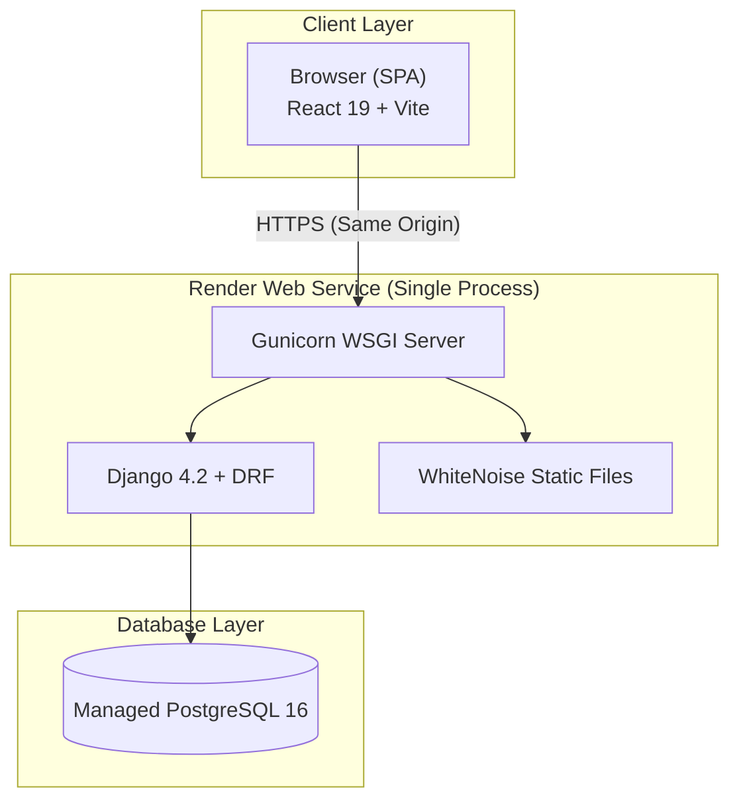
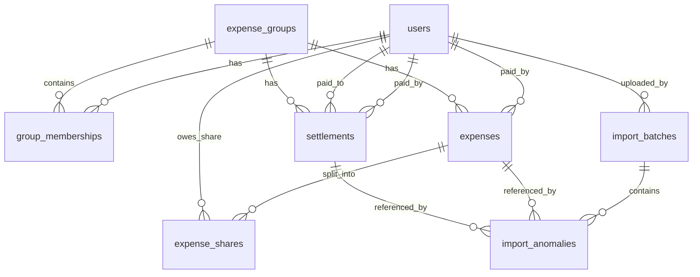

# 💸 Spreetail — Shared Expenses for Flatmates

A production-grade expense tracker that handles messy CSV imports, multi-currency conversions, timeline-aware group memberships, and 17 automated anomaly detection rules.

**Live Demo**: [https://splitwise-oq43.onrender.com](https://splitwise-oq43.onrender.com)

---

## Table of Contents

- [Overview](#overview)
- [Key Features](#key-features)
- [Tech Stack](#tech-stack)
- [Architecture](#architecture)
- [Database Schema](#database-schema)
- [API Reference](#api-reference)
- [CSV Import and Anomaly Engine](#csv-import-and-anomaly-engine)
- [Balance Calculation](#balance-calculation)
- [Project Structure](#project-structure)
- [Getting Started](#getting-started)
- [Environment Variables](#environment-variables)
- [Deployment](#deployment)
- [Design Decisions](#design-decisions)
- [Documentation Index](#documentation-index)

---

## Overview

Spreetail is a **shared expense management application** built for a group of flatmates (Aisha, Rohan, Priya, Meera, Dev, and Sam) tracking real-world expenses from February to April 2026 — including a Goa trip, flatmate transitions, multi-currency payments, and a deliberately messy CSV export.

The system doesn't just record expenses — it **ingests chaotic real-world data**, detects 17 categories of anomalies, auto-corrects what it can, flags what it can't, and produces a fully auditable trail that humans can approve or reject.

---

## Key Features

### Expense Management
- **Four split types** — Equal, Percentage, Exact amounts, Share/ratio
- **Multi-currency** — USD to INR conversion at documented fixed rate (₹83.50)
- **Rounding precision** — Largest Remainder Method (Hare-Niemeyer) ensures every paisa adds up

### Timeline-Aware Groups
- Members have **join/leave dates** — expenses are only split among members active on the transaction date
- **Quick registration** — create new users inline from the Add Member modal
- Meera leaving in March, Sam arriving in April — the system handles it automatically

### Live Balance Engine
- **Zero stored balances** — every number is computed live from expense_shares rows
- **Greedy settlement simplification** — minimizes the number of payments needed to clear all debts
- **Drill-down verification** — click any balance to see the complete formula: Paid - Owed + Received - Sent = Net

### CSV Import Pipeline
- **17 anomaly detection rules** — dates, duplicates, currencies, names, splits, membership windows
- **Intelligent auto-correction** — normalizes formats, resolves aliases, converts currencies, re-routes settlements
- **Human-in-the-loop** — anything the system can't resolve is flagged for manual review with Approve/Reject controls
- **Full auditability** — every original CSV row is preserved as JSON, every decision is logged

### Settlement Tracking
- Record direct payments between flatmates
- Settlements detected in CSV are auto-rerouted (anomaly #5)
- Balances update in real time

---

## Tech Stack

| Layer | Technology | Why |
|-------|-----------|-----|
| **Backend** | Django 4.2 + Django REST Framework | Python excels at CSV parsing and data pipelines. Django ORM provides type-safe aggregation queries for balance calculations |
| **Frontend** | React 19 (Vite) | Fast builds, HMR in dev. Compiled to static assets for production |
| **Database** | PostgreSQL 16 | ACID transactions for atomic CSV imports. Robust aggregation for live balance queries |
| **Auth** | DRF TokenAuthentication | Simple stateless auth. PBKDF2-SHA256 password hashing via Django |
| **Static Files** | WhiteNoise | Serves Vite's compiled output directly from Django — no Nginx or CDN needed |
| **WSGI Server** | Gunicorn | Production-grade Python WSGI server on Render |
| **Deploy** | Render (free tier) | Single web service + managed Postgres. Auto-deploys from main branch |

---

## Architecture

### High-Level Overview



### Request Routing

| Request | Route | Handler |
|---------|-------|---------|
| `POST /api/auth/login/` | DRF API | `LoginView` — authenticate, return token |
| `GET /api/groups/` | DRF API | `GroupViewSet` — list groups with memberships |
| `POST /api/expenses/` | DRF API | `ExpenseViewSet` — create expense with split allocation |
| `GET /api/expenses/groups/1/balances/` | DRF API | `GroupBalancesView` — live SUM queries + greedy settlements |
| `POST /api/imports/upload/` | DRF API | `ImportUploadView` — parse CSV, run 17 rules, atomic insert |
| `GET /assets/index-*.js` | WhiteNoise | Serves compiled React bundle |
| `GET /any/other/path` | Catch-all | Serves `index.html` for React Router |

### Why Single-Origin?

No CORS configuration needed. The React build is served by Django via WhiteNoise as static files. API calls are same-origin `/api/` requests. This eliminates an entire class of deployment bugs.

---

## Database Schema

### Tables

| Table | Model | Purpose |
|-------|-------|---------|
| `users` | `accounts.User` | User identity, email-based login, display name |
| `expense_groups` | `groups.Group` | Expense-sharing group container |
| `group_memberships` | `groups.GroupMembership` | User-Group junction with join/leave dates |
| `expenses` | `expenses.Expense` | Payments made by one person on behalf of the group |
| `expense_shares` | `expenses.ExpenseShare` | Per-user share of each expense (source of truth for balances) |
| `settlements` | `expenses.Settlement` | Direct payments between users to clear debts |
| `import_batches` | `imports.ImportBatch` | Metadata for each CSV upload |
| `import_anomalies` | `imports.ImportAnomaly` | Every detected issue during import |

### Relationships



### Key Schema Design Principles

| Principle | Implementation |
|-----------|----------------|
| **No stored balances** | Every balance is computed via SUM() over expense_shares and settlements. No cache drift possible. |
| **Full auditability** | Original amounts + currencies preserved. FX rate recorded. share_raw explains the math. raw_row stores original CSV row as JSON. |
| **Timeline awareness** | `GroupMembership.covers_date()` gates every split calculation. |
| **Referential integrity** | `paid_by` uses PROTECT on delete — cannot delete a user who has expenses. |

---

## API Reference

### Authentication

| Method | Endpoint | Auth | Description |
|--------|----------|------|-------------|
| `POST` | `/api/auth/register/` | Public | Register a new user. Returns token + user |
| `POST` | `/api/auth/login/` | Public | Login. Returns token + user |
| `POST` | `/api/auth/logout/` | Token | Invalidate token |
| `GET` | `/api/auth/me/` | Token | Get current authenticated user |
| `GET` | `/api/auth/users/` | Token | List all registered users |

### Groups and Memberships

| Method | Endpoint | Description |
|--------|----------|-------------|
| `GET` | `/api/groups/` | List all groups (with nested memberships) |
| `POST` | `/api/groups/` | Create a new group |
| `GET/PUT/PATCH/DELETE` | `/api/groups/:id/` | Group detail CRUD |
| `GET` | `/api/groups/:id/members/` | List group memberships |
| `POST` | `/api/groups/:id/members/` | Add member with join/leave dates |
| `PATCH` | `/api/groups/:id/members/:mid/` | Update membership dates |
| `DELETE` | `/api/groups/:id/members/:mid/` | Remove membership |

### Expenses and Splits

| Method | Endpoint | Description |
|--------|----------|-------------|
| `GET` | `/api/expenses/?group=:id` | List expenses (filterable by group) |
| `POST` | `/api/expenses/` | Create expense with split allocation |
| `GET/PUT/PATCH/DELETE` | `/api/expenses/:id/` | Expense detail CRUD |

### Balances and Settlements

| Method | Endpoint | Description |
|--------|----------|-------------|
| `GET` | `/api/expenses/groups/:id/balances/` | Live computed balances + greedy settlement suggestions |
| `GET` | `/api/expenses/users/:id/balance-detail/?group=:gid` | Audit drill-down for one user |
| `GET/POST` | `/api/expenses/settlements/` | List or record settlement payments |

### CSV Import

| Method | Endpoint | Description |
|--------|----------|-------------|
| `POST` | `/api/imports/upload/` | Upload CSV file, run anomaly pipeline |
| `GET` | `/api/imports/:batch_id/report/` | Get import report with all anomalies |
| `POST` | `/api/imports/anomalies/:id/resolve/` | Approve or reject an anomaly |

### Health Check

| Method | Endpoint | Description |
|--------|----------|-------------|
| `GET` | `/api/health/` | Returns `{"status": "ok"}` — unauthenticated |

---

## CSV Import and Anomaly Engine

The import pipeline processes a real-world CSV file containing 43 expense rows with intentionally messy data. It applies **17 detection rules** in a single atomic database transaction.

### Anomaly Detection Catalogue

| # | Category | Detection Rule | Auto-Resolution |
|---|----------|---------------|-----------------|
| 1 | Mixed date formats | Non-ISO dates (01/03/2026, Mar 14) | Normalize to YYYY-MM-DD |
| 2 | Ambiguous dates | DD/MM vs MM/DD (04/05/2026) | Default DD/MM (Indian locale), flag for review |
| 3 | Exact duplicates | Same date + payer + amount | Import first, skip second, log both |
| 4 | Conflicting duplicates | Same signature, different details | Import both as "disputed" status |
| 5 | Settlement as expense | Keywords: "paid back", "settle" | Re-route to settlements table |
| 6 | USD amounts | currency == USD | Convert at Rs.83.50, store fx_rate_to_inr |
| 7 | Missing currency | Currency field blank | Default to INR, flag |
| 8 | Amount formatting | Commas, spaces, symbols (1,200) | Strip/parse/round to 2 decimal places |
| 9 | Negative amount | amount < 0 | Treat as refund, flag |
| 10 | Zero amount | amount == 0 | Create as "voided" status, flag |
| 11 | Inconsistent names | "priya", "Priya S", "rohan " | Alias map + whitespace normalization |
| 12 | Missing payer | Payer field blank | Mark needs_review, no expense created |
| 13 | Percentage != 100% | Split percentages sum to 110% | Rescale proportionally, flag |
| 14 | Split type mismatch | split_type contradicts split_details | Use details if provided, flag |
| 15 | Non-member in split | Person not a registered user | Exclude from split, recompute shares |
| 16 | Outside membership window | Member not active on expense date | Exclude from split, recompute shares |
| 17 | Excluded participant | Guest (Kabir) not a registered user | Exclude entirely, log as anomaly |

### Pipeline Flow

```
CSV Upload
    │
    ▼
Parse Headers (dynamic keyword-based column mapping)
    │
    ▼
Row-by-Row Processing ──────────────────────────────────────────
    │                                                           │
    ├── Date Parsing ─── Non-ISO? Normalize + flag #1           │
    │                 └── Ambiguous? Default DD/MM + flag #2    │
    │                                                           │
    ├── Duplicate Check ── Exact match? Skip + flag #3          │
    │                   └── Conflicting? Import disputed #4     │
    │                                                           │
    ├── Settlement Detection ── Keywords? Re-route #5           │
    │                                                           │
    ├── Currency & Amount ── USD? Convert #6                    │
    │                     ├── Missing? Default INR #7           │
    │                     ├── Formatting? Clean #8              │
    │                     ├── Negative? Refund #9               │
    │                     └── Zero? Void #10                    │
    │                                                           │
    ├── Name Resolution ── Normalize + alias map #11            │
    │                   ├── Missing payer? needs_review #12     │
    │                   └── Guest (Kabir)? Exclude #17          │
    │                                                           │
    └── Split Validation ── % != 100? Rescale #13               │
                         ├── Type mismatch? Use details #14     │
                         ├── Non-member? Exclude #15            │
                         └── Outside window? Exclude #16        │
                                                                │
    ◄───────────────────────────────────────────────────────────┘
    │
    ▼
Atomic DB Transaction
    │
    ▼
ImportBatch + ImportAnomalies + Expenses + Shares + Settlements
```

---

## Balance Calculation

Balances are **never stored** — they are computed live from underlying rows.

### The Formula

```
Net Balance = SUM(expenses paid) - SUM(shares owed) + SUM(settlements received) - SUM(settlements paid)
```

- **Positive** = the group owes you money
- **Negative** = you owe the group money

### Greedy Settlement Simplification

The system computes the minimum set of payments to resolve all debts:

```
1. Sort all members by net balance
2. Pair the largest debtor with the largest creditor
3. Transfer min(|debt|, credit)
4. Remove anyone who reaches zero
5. Repeat until all balances clear
```

This reduces potentially N-squared pairwise debts to at most N-1 transactions.

### Rounding: Largest Remainder Method

When splitting Rs.835.00 equally among 3 people:
- Naive: Rs.278.33 x 3 = Rs.834.99 (Rs.0.01 missing!)
- Spreetail: Allocates the residual paisa to the member with the largest fractional remainder, with user ID as a deterministic tiebreaker. Sum always equals the total.

---

## Project Structure

```
spreetail/
├── backend/
│   ├── accounts/            # User model, auth views, serializers
│   ├── groups/              # Group + membership management
│   ├── expenses/            # Expenses, splits, settlements, balances
│   ├── imports/             # CSV pipeline + 17 anomaly rules (570+ lines)
│   ├── spreetail/           # Django project config (settings, urls, wsgi)
│   ├── manage.py
│   └── requirements.txt
│
├── frontend/
│   ├── src/
│   │   ├── api/client.js         # Thin fetch wrapper with Token auth
│   │   ├── contexts/AuthContext.jsx
│   │   └── pages/
│   │       ├── AuthPage.jsx      # Login + Registration
│   │       ├── DashboardPage.jsx # Sidebar + tab navigation
│   │       ├── GroupsTab.jsx     # Groups, members, expenses, balances
│   │       ├── ExpensesTab.jsx   # System-wide expense browser
│   │       └── ImportsTab.jsx    # CSV upload + anomaly review
│   ├── vite.config.js
│   └── package.json
│
├── expenses_export.csv      # The messy real-world CSV (43 rows)
├── render.yaml              # Render deployment blueprint
├── DECISIONS.md             # Architectural decision log (D-001 to D-011)
├── SCOPE.md                 # Schema + anomaly catalogue
├── PROGRESS.md              # Step-by-step build progress
└── AI_USAGE.md              # AI tool usage documentation
```

---

## Getting Started

### Prerequisites

- Python 3.11+
- Node.js 18+
- PostgreSQL 14+ (or use a remote DB via DATABASE_URL)

### 1. Clone the Repository

```bash
git clone https://github.com/pavandoddavarapu/splitwise.git
cd splitwise
```

### 2. Backend Setup

```bash
cd backend
python -m venv .venv
source .venv/bin/activate    # Windows: .venv\Scripts\activate
pip install -r requirements.txt

cp .env.example .env
# Edit .env with your DATABASE_URL, SECRET_KEY, etc.

python manage.py migrate
python manage.py runserver
```

### 3. Frontend Setup

```bash
cd frontend
npm install
npm run dev
# Vite dev server starts on :5173, proxies /api/ to Django on :8000
```

### 4. Production Build (Optional)

```bash
cd frontend && npm run build
cd ../backend && python manage.py collectstatic --noinput
python manage.py runserver
# Visit http://localhost:8000 — full production-like setup
```

---

## Environment Variables

Create `backend/.env` from `backend/.env.example`:

| Variable | Required | Description |
|----------|----------|-------------|
| `SECRET_KEY` | Yes | Django cryptographic signing key |
| `DEBUG` | No | True for development, False for production |
| `DATABASE_URL` | Yes | PostgreSQL connection string |
| `ALLOWED_HOSTS` | No | Comma-separated list of allowed hostnames |

---

## Deployment

### Render (Current Setup)

The app deploys as a **single Render web service** using `render.yaml`:

**Build pipeline** (runs on every git push to main):
1. `pip install -r backend/requirements.txt` — Python deps
2. `cd frontend && npm install && npm run build` — React build
3. `python manage.py collectstatic --noinput` — Copy dist/ to staticfiles/
4. `python manage.py migrate` — Apply DB migrations

**Start command**: `gunicorn spreetail.wsgi:application --bind 0.0.0.0:$PORT`

The Render blueprint also provisions a **managed PostgreSQL instance** and auto-wires `DATABASE_URL`.

---

## Design Decisions

Key architectural choices are documented in `DECISIONS.md`. Highlights:

| Decision | Summary |
|----------|---------|
| **D-001** | Django + DRF instead of Next.js — Python is stronger for the CSV/anomaly pipeline |
| **D-002** | Fixed FX rate Rs.83.50/USD — documented, reproducible, auditable |
| **D-003** | AbstractUser — Django auth machinery with custom fields |
| **D-004** | Monorepo — single render.yaml deploys everything |
| **D-005** | Kabir excluded — one-day guest logged as anomaly, not a user |
| **D-006** | No stored balances — live SUM() queries for auditability |
| **D-007** | Token in localStorage — accepted XSS tradeoff for simplicity |
| **D-008** | Largest Remainder Method — deterministic rounding for paisa-perfect totals |
| **D-009** | Greedy settlement simplification — O(n log n), at most N-1 payments |
| **D-010** | Dynamic CSV header matching — keyword-based, case-insensitive |
| **D-011** | Atomic imports — entire CSV in one transaction, rollback on failure |

---

## Documentation Index

| Document | Purpose |
|----------|---------|
| `README.md` | This file — architecture, setup, API reference |
| `DECISIONS.md` | Architectural decision log with rationale and alternatives considered |
| `SCOPE.md` | Database schema (column-level detail) and anomaly catalogue with specific CSV row examples |
| `PROGRESS.md` | Step-by-step build log |
| `AI_USAGE.md` | AI tools, key prompts, and 5 documented AI mistakes |
| `render.yaml` | Render deployment blueprint |
| `expenses_export.csv` | The messy real-world CSV test data (43 rows, 17+ anomalies) |

---

*Built by [Pavan Doddavarapu](https://github.com/pavandoddavarapu)*
